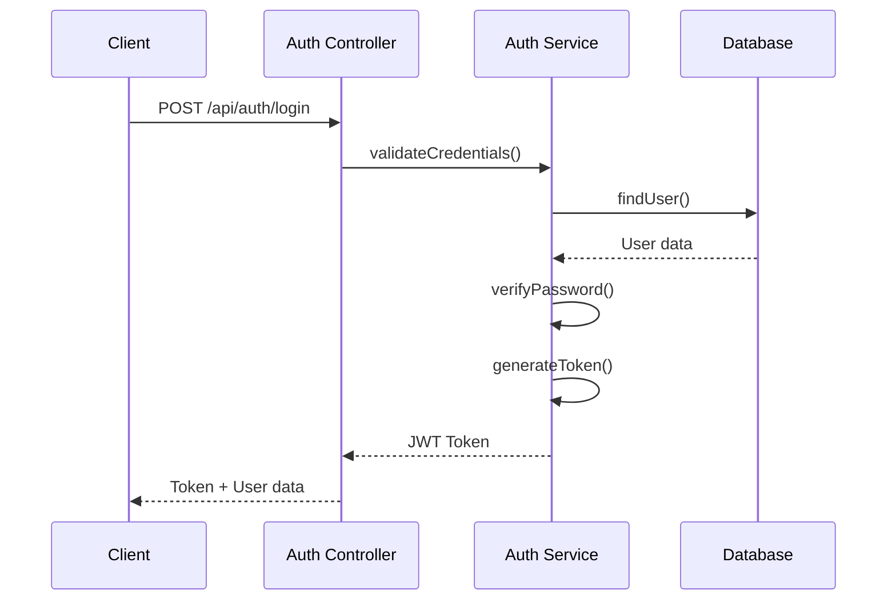

# Backend Architecture Documentation

## Directory Structure

```
src/
├── config/           # Configuration files
│   ├── database.ts   # Database configuration
│   ├── jwt.ts        # JWT configuration
│   └── swagger.ts    # API documentation config
├── controllers/      # Request handlers
│   ├── auth.ts       # Authentication controllers
│   ├── products.ts   # Product management
│   └── stock.ts      # Stock operations
├── middleware/       # Express middleware
│   ├── auth.ts       # JWT verification
│   ├── validate.ts   # Request validation
│   └── error.ts      # Error handling
├── models/          # Database models
│   ├── user.ts      # User model
│   ├── product.ts   # Product model
│   └── stock.ts     # Stock model
├── services/        # Business logic
│   ├── auth.ts      # Authentication service
│   ├── product.ts   # Product service
│   └── stock.ts     # Stock service
├── utils/           # Utility functions
│   ├── logger.ts    # Logging utility
│   └── validation.ts # Validation helpers
└── server.ts        # Application entry point
```

## Authentication Flow



## Middleware Organization

### Authentication Middleware
```typescript
// src/middleware/auth.ts
import { Request, Response, NextFunction } from 'express';
import jwt from 'jsonwebtoken';

export const authenticateToken = (req: Request, res: Response, next: NextFunction) => {
  const token = req.headers.authorization?.split(' ')[1];
  if (!token) return res.status(401).json({ error: 'Authentication required' });

  try {
    const user = jwt.verify(token, process.env.JWT_SECRET as string);
    req.user = user;
    next();
  } catch (error) {
    return res.status(403).json({ error: 'Invalid token' });
  }
};

export const requireRole = (roles: string[]) => {
  return (req: Request, res: Response, next: NextFunction) => {
    if (!roles.includes(req.user.role)) {
      return res.status(403).json({ error: 'Insufficient permissions' });
    }
    next();
  };
};
```

### Validation Middleware
```typescript
// src/middleware/validate.ts
import { Request, Response, NextFunction } from 'express';
import { validationResult, ValidationChain } from 'express-validator';

export const validate = (validations: ValidationChain[]) => {
  return async (req: Request, res: Response, next: NextFunction) => {
    await Promise.all(validations.map(validation => validation.run(req)));
    const errors = validationResult(req);
    
    if (!errors.isEmpty()) {
      return res.status(400).json({ errors: errors.array() });
    }
    next();
  };
};
```

## Error Handling Strategy

```typescript
// src/middleware/error.ts
import { Request, Response, NextFunction } from 'express';

export class AppError extends Error {
  constructor(
    public message: string,
    public statusCode: number,
    public code?: string
  ) {
    super(message);
  }
}

export const errorHandler = (
  error: Error,
  req: Request,
  res: Response,
  next: NextFunction
) => {
  if (error instanceof AppError) {
    return res.status(error.statusCode).json({
      error: {
        message: error.message,
        code: error.code
      }
    });
  }

  // Log unexpected errors
  console.error(error);
  return res.status(500).json({
    error: {
      message: 'Internal server error',
      code: 'INTERNAL_ERROR'
    }
  });
};
```

## Service Layer Pattern

### Example Product Service
```typescript
// src/services/product.ts
import { prisma } from '../lib/prisma';
import { AppError } from '../middleware/error';

export class ProductService {
  async create(data: CreateProductDTO) {
    const existingProduct = await prisma.product.findUnique({
      where: { sku: data.sku }
    });

    if (existingProduct) {
      throw new AppError('Product SKU already exists', 400, 'DUPLICATE_SKU');
    }

    return prisma.product.create({ data });
  }

  async update(id: number, data: UpdateProductDTO) {
    const product = await prisma.product.findUnique({ where: { id } });
    
    if (!product) {
      throw new AppError('Product not found', 404, 'PRODUCT_NOT_FOUND');
    }

    return prisma.product.update({
      where: { id },
      data
    });
  }

  async delete(id: number) {
    const product = await prisma.product.findUnique({ where: { id } });
    
    if (!product) {
      throw new AppError('Product not found', 404, 'PRODUCT_NOT_FOUND');
    }

    // Check if product can be deleted
    const hasStockMovements = await prisma.stockMovement.findFirst({
      where: { productId: id }
    });

    if (hasStockMovements) {
      throw new AppError(
        'Cannot delete product with stock movements',
        400,
        'PRODUCT_HAS_MOVEMENTS'
      );
    }

    return prisma.product.delete({ where: { id } });
  }
}
```

## File Upload Handling

```typescript
// src/middleware/upload.ts
import multer from 'multer';
import path from 'path';

const storage = multer.diskStorage({
  destination: (req, file, cb) => {
    cb(null, 'uploads/');
  },
  filename: (req, file, cb) => {
    const uniqueSuffix = Date.now() + '-' + Math.round(Math.random() * 1E9);
    cb(null, file.fieldname + '-' + uniqueSuffix + path.extname(file.originalname));
  }
});

export const upload = multer({
  storage,
  limits: {
    fileSize: 5 * 1024 * 1024 // 5MB limit
  },
  fileFilter: (req, file, cb) => {
    const allowedTypes = ['image/jpeg', 'image/png', 'application/pdf'];
    if (!allowedTypes.includes(file.mimetype)) {
      cb(new Error('Invalid file type'));
      return;
    }
    cb(null, true);
  }
});
```

## Security Considerations

1. **JWT Configuration**
```typescript
// src/config/jwt.ts
import jwt from 'jsonwebtoken';

export const jwtConfig = {
  secret: process.env.JWT_SECRET as string,
  expiresIn: '24h',
  refreshExpiresIn: '7d',
  algorithm: 'HS256' as const
};

export const generateToken = (payload: any) => {
  return jwt.sign(payload, jwtConfig.secret, {
    expiresIn: jwtConfig.expiresIn,
    algorithm: jwtConfig.algorithm
  });
};
```

2. **Password Hashing**
```typescript
// src/utils/password.ts
import bcrypt from 'bcrypt';

export const hashPassword = async (password: string): Promise<string> => {
  const salt = await bcrypt.genSalt(10);
  return bcrypt.hash(password, salt);
};

export const verifyPassword = async (
  password: string,
  hashedPassword: string
): Promise<boolean> => {
  return bcrypt.compare(password, hashedPassword);
};
```

3. **Rate Limiting**
```typescript
// src/middleware/rateLimit.ts
import rateLimit from 'express-rate-limit';

export const authLimiter = rateLimit({
  windowMs: 15 * 60 * 1000, // 15 minutes
  max: 5 // limit each IP to 5 requests per windowMs
});

export const apiLimiter = rateLimit({
  windowMs: 15 * 60 * 1000,
  max: 100
});
```