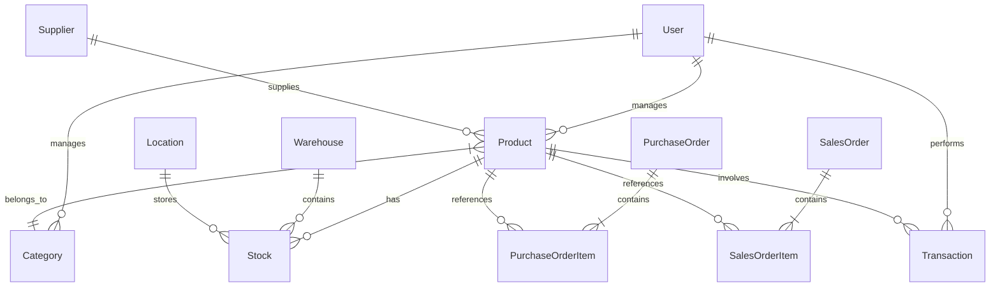

# Database Documentation

## Schema Overview

### Entity Relationship Diagram


## Table Definitions

### Users Table
```sql
CREATE TABLE users (
    id SERIAL PRIMARY KEY,
    username VARCHAR(50) UNIQUE NOT NULL,
    hashed_password VARCHAR(255) NOT NULL,
    role VARCHAR(20) NOT NULL,
    created_at TIMESTAMP WITH TIME ZONE DEFAULT CURRENT_TIMESTAMP,
    updated_at TIMESTAMP WITH TIME ZONE DEFAULT CURRENT_TIMESTAMP,
    CONSTRAINT valid_role CHECK (role IN ('admin', 'manager', 'user'))
);

CREATE INDEX idx_users_username ON users(username);
```

### Products Table
```sql
CREATE TABLE products (
    id SERIAL PRIMARY KEY,
    name VARCHAR(100) NOT NULL,
    sku VARCHAR(50) UNIQUE NOT NULL,
    barcode VARCHAR(50) UNIQUE NOT NULL,
    description TEXT,
    category_id INTEGER REFERENCES categories(id),
    supplier_id INTEGER REFERENCES suppliers(id),
    unit_price DECIMAL(10,2) NOT NULL,
    price DECIMAL(10,2) NOT NULL,
    created_at TIMESTAMP WITH TIME ZONE DEFAULT CURRENT_TIMESTAMP,
    updated_at TIMESTAMP WITH TIME ZONE DEFAULT CURRENT_TIMESTAMP
);

CREATE INDEX idx_products_sku ON products(sku);
CREATE INDEX idx_products_barcode ON products(barcode);
CREATE INDEX idx_products_category ON products(category_id);
```

### Stock Table
```sql
CREATE TABLE stock (
    id SERIAL PRIMARY KEY,
    product_id INTEGER REFERENCES products(id),
    warehouse_id INTEGER REFERENCES warehouses(id),
    location_id INTEGER REFERENCES locations(id),
    quantity INTEGER NOT NULL DEFAULT 0,
    created_at TIMESTAMP WITH TIME ZONE DEFAULT CURRENT_TIMESTAMP,
    updated_at TIMESTAMP WITH TIME ZONE DEFAULT CURRENT_TIMESTAMP,
    CONSTRAINT positive_quantity CHECK (quantity >= 0)
);

CREATE INDEX idx_stock_product ON stock(product_id);
CREATE INDEX idx_stock_warehouse ON stock(warehouse_id);
CREATE INDEX idx_stock_location ON stock(location_id);
```

## Triggers

### Update Timestamp Trigger
```sql
CREATE OR REPLACE FUNCTION update_timestamp()
RETURNS TRIGGER AS $$
BEGIN
    NEW.updated_at = CURRENT_TIMESTAMP;
    RETURN NEW;
END;
$$ language 'plpgsql';

CREATE TRIGGER update_users_timestamp
    BEFORE UPDATE ON users
    FOR EACH ROW
    EXECUTE FUNCTION update_timestamp();

-- Similar triggers for other tables
```

### Stock Movement Audit Trigger
```sql
CREATE OR REPLACE FUNCTION audit_stock_movement()
RETURNS TRIGGER AS $$
BEGIN
    INSERT INTO stock_movements (
        stock_id,
        previous_quantity,
        new_quantity,
        movement_type,
        user_id,
        created_at
    ) VALUES (
        NEW.id,
        OLD.quantity,
        NEW.quantity,
        CASE 
            WHEN NEW.quantity > OLD.quantity THEN 'IN'
            ELSE 'OUT'
        END,
        current_user_id(),
        CURRENT_TIMESTAMP
    );
    RETURN NEW;
END;
$$ language 'plpgsql';

CREATE TRIGGER stock_movement_audit
    AFTER UPDATE OF quantity ON stock
    FOR EACH ROW
    EXECUTE FUNCTION audit_stock_movement();
```

## Views

### Current Stock Levels
```sql
CREATE VIEW current_stock_levels AS
SELECT 
    p.id AS product_id,
    p.name AS product_name,
    p.sku,
    w.name AS warehouse_name,
    l.name AS location_name,
    s.quantity,
    p.unit_price,
    (p.unit_price * s.quantity) AS total_value
FROM stock s
JOIN products p ON s.product_id = p.id
JOIN warehouses w ON s.warehouse_id = w.id
JOIN locations l ON s.location_id = l.id;
```

### Low Stock Alert
```sql
CREATE VIEW low_stock_alert AS
SELECT 
    p.id AS product_id,
    p.name AS product_name,
    p.sku,
    SUM(s.quantity) AS total_quantity,
    p.min_quantity AS minimum_required
FROM products p
LEFT JOIN stock s ON p.id = s.product_id
GROUP BY p.id, p.name, p.sku, p.min_quantity
HAVING SUM(s.quantity) <= p.min_quantity;
```

## Indexes

### Performance Indexes
```sql
-- Products search
CREATE INDEX idx_products_name_gin ON products USING gin(name gin_trgm_ops);
CREATE INDEX idx_products_sku_gin ON products USING gin(sku gin_trgm_ops);

-- Stock queries
CREATE INDEX idx_stock_compound ON stock(product_id, warehouse_id, location_id);

-- Transaction date ranges
CREATE INDEX idx_purchase_orders_date ON purchase_orders(created_at);
CREATE INDEX idx_sales_orders_date ON sales_orders(created_at);
```

## Constraints

### Foreign Key Constraints
```sql
-- Products
ALTER TABLE products
ADD CONSTRAINT fk_product_category
FOREIGN KEY (category_id)
REFERENCES categories(id)
ON DELETE RESTRICT;

ALTER TABLE products
ADD CONSTRAINT fk_product_supplier
FOREIGN KEY (supplier_id)
REFERENCES suppliers(id)
ON DELETE RESTRICT;

-- Stock
ALTER TABLE stock
ADD CONSTRAINT fk_stock_product
FOREIGN KEY (product_id)
REFERENCES products(id)
ON DELETE RESTRICT;

ALTER TABLE stock
ADD CONSTRAINT fk_stock_warehouse
FOREIGN KEY (warehouse_id)
REFERENCES warehouses(id)
ON DELETE RESTRICT;
```

### Check Constraints
```sql
-- Price validation
ALTER TABLE products
ADD CONSTRAINT valid_prices
CHECK (unit_price > 0 AND price > 0 AND price >= unit_price);

-- Quantity validation
ALTER TABLE stock
ADD CONSTRAINT valid_quantity
CHECK (quantity >= 0);

-- Order status validation
ALTER TABLE purchase_orders
ADD CONSTRAINT valid_po_status
CHECK (status IN ('draft', 'pending', 'approved', 'received', 'cancelled'));
```

## Backup and Recovery

### Backup Strategy
1. Daily full database backup
2. Continuous WAL archiving
3. Point-in-time recovery capability

### Backup Script
```bash
#!/bin/bash
BACKUP_DIR="/backup/database"
TIMESTAMP=$(date +%Y%m%d_%H%M%S)
DB_NAME="inventory"

# Create backup
pg_dump -Fc -f "$BACKUP_DIR/$DB_NAME_$TIMESTAMP.dump" $DB_NAME

# Keep last 7 days of backups
find $BACKUP_DIR -type f -mtime +7 -delete
```

## Performance Optimization

### Query Optimization
1. Use appropriate indexes
2. Regular VACUUM and ANALYZE
3. Partitioning for large tables
4. Materialized views for complex queries

### Connection Pooling
```javascript
// Database connection pool configuration
const pool = new Pool({
  max: 20,
  idleTimeoutMillis: 30000,
  connectionTimeoutMillis: 2000,
});
```